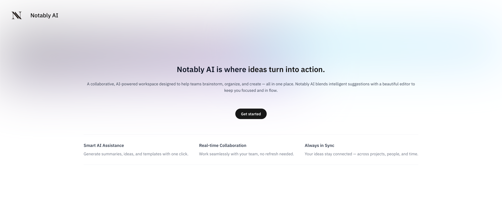
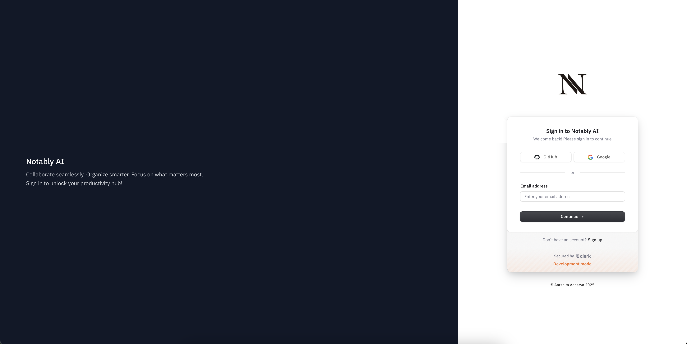
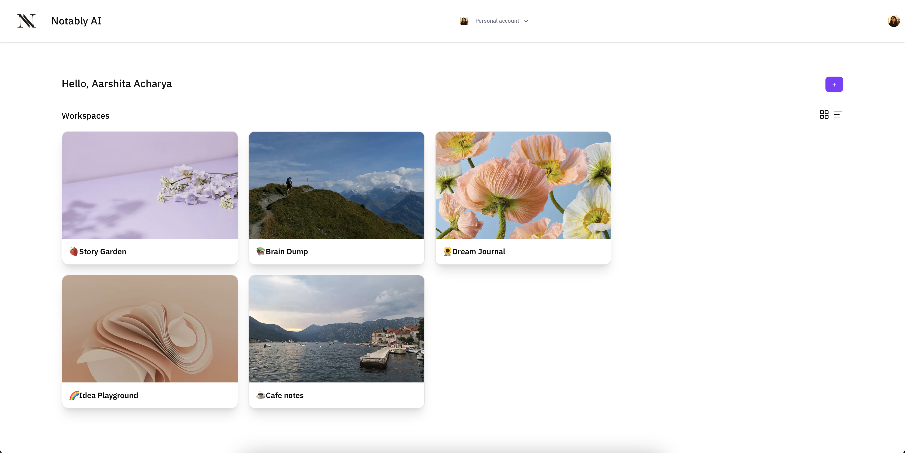
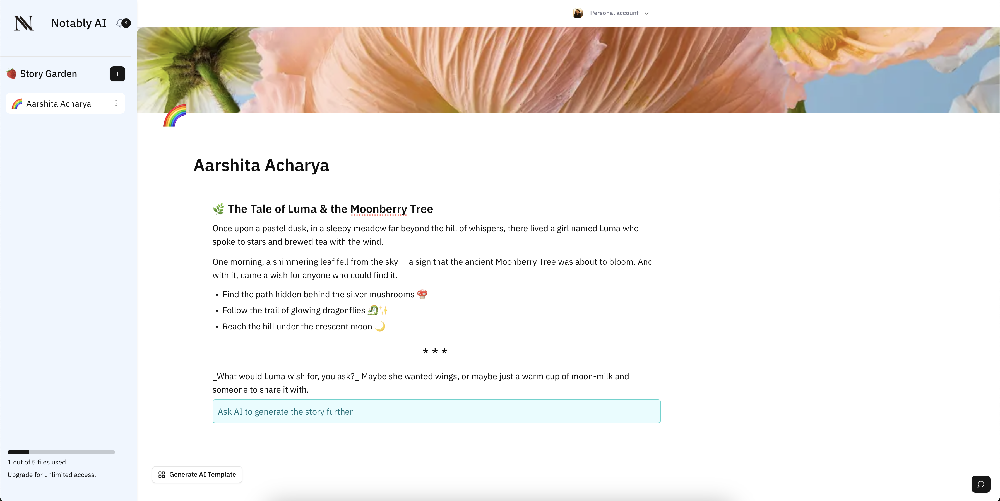
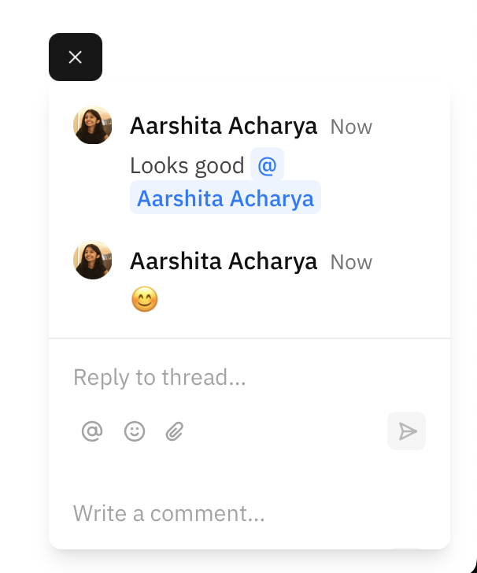
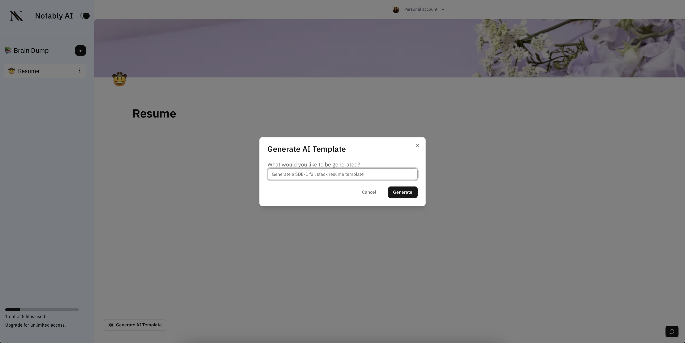
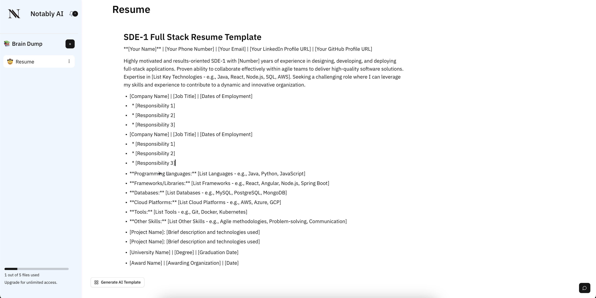

[](LICENSE)

## Notably AI
*A modern, AI-powered workspace for your thoughts. Think better. Write faster. Collaborate smarter.*

Notably AI is a dynamic collaborative workspace designed to help individuals and teams organize ideas, take structured notes, and generate content with the power of AI. Inspired by the needs of researchers, writers, and creators, it brings together a block-based editor, real-time collaboration, and AI assistance, all in a clean, distraction-free interface.

Whether you're brainstorming product features, drafting a blog, or working with your team across the globe, Notably AI keeps your ideas flowing and your work synced.

---
### Live Demo

[Try Notably AI Live](https://notably-ai.netlify.app) 

---
### Features

- **Landing Page**  
  A clean, modern homepage that introduces Notably AI and allows users to explore or get started easily.  
  

- **Authentication with Clerk**  
  Secure sign-in and sign-out functionality using Clerk, supporting both individual and organizational accounts.  
  

- **Dashboard**  
  A centralized dashboard showing all personal and organization workspaces, enabling seamless navigation and management.  
  

- **Workspaces & Documents**  
  Unlimited workspaces, each workspace supports up to 5 documents in the free tier.

  Workspace-level isolation and sharing features  

- **Rich Text Editor**  
  Supports block-based editing using Editor.js — ideal for organizing thoughts, writing structured documents, and collaborating visually.  
  

- **Comments & Mentions**  
  Collaborate with others using inline comments and @mentions to keep discussions contextual and clear.  
  

- **AI-Powered Writing Assistance**  
  Integrated with Google’s Generative AI to generate, expand, or summarize content right inside your documents.  
  
  

---
### Tech Stack

- **Framework**: Next.js 14 (App Router)
- **Styling**: Tailwind CSS, shadcn/ui
- **Auth**: Clerk
- **Database**: Firebase 
- **Editor**: Editor.js 
- **AI Integration**: Google Generative AI 
- **Deployment**: Netlify

---
### Getting Started

Follow these steps to run Notably AI locally for development or testing.

---

#### 1. Clone the repository

```bash
git clone https://github.com/aarshitaacharya/notably-ai.git
cd notably-ai
```
#### 2. Install dependencies
```bash
npm install
```

### 3. Create environment variables

Create a file named `.env.local` in the root directory of the project and paste the following:

```env
# Clerk Authentication
NEXT_PUBLIC_CLERK_PUBLISHABLE_KEY=your_clerk_publishable_key
CLERK_SECRET_KEY=your_clerk_secret_key
NEXT_PUBLIC_CLERK_SIGN_IN_URL=/sign-in
NEXT_PUBLIC_CLERK_SIGN_UP_URL=/sign-up

# Firebase Configuration
NEXT_PUBLIC_FIREBASE_API_KEY=your_firebase_api_key

# Liveblocks for Real-time Collaboration
NEXT_PUBLIC_LIVEBLOCK_PK=your_liveblocks_public_key
LIVEBLOCK_SK=your_liveblocks_secret_key

# Google Gemini AI Key
NEXT_PUBLIC_GEMINI_API_KEY=your_gemini_api_key
```

#### 4. Start the development server
```bash
npm run dev
```

#### 5. Open app in your browser, navigate to:
```bash
https://localhost:3000
```

You should now be able to:

- Sign in or sign up using Clerk
- Create and manage workspaces
- Edit rich documents with real-time sync
- Generate content using built-in AI tools
---

### Work in Progress:
Notably AI is actively evolving. Here are some upcoming features and enhancements we're working on:

- **Sharing via Public/Private Links**  
  Enable users to share documents or entire workspaces with others via access-controlled links.

- **Improved Notification System**  
  Centralized notification hub with proper routing and read/unread state handling.

- **Version History & Undo**  
  Track document changes over time and allow users to restore previous versions.


Contributions and feedback are welcome! Feel free to open an issue or suggest features you'd like to see.

## 📄 License

This project is licensed under the [MIT License](LICENSE).